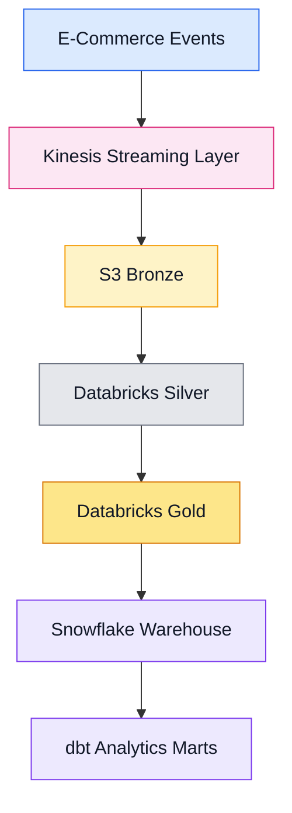

<div align="center">

# Real-Time E-Commerce Analytics Platform on AWS

### Portfolio-grade streaming analytics platform for high-volume e-commerce events using AWS, Kinesis, Databricks, Snowflake, dbt, Airflow, Terraform, Kubernetes, Docker, and CI/CD.


</div>

---

## Project Overview

**Real-Time E-Commerce Analytics Platform on AWS** is a production-style data engineering project that processes high-volume e-commerce events such as orders, clicks, payments, customer sessions, product views, and shipment updates.

The platform moves events from containerized Python producers into AWS streaming infrastructure, stores immutable raw data in an S3 Bronze layer, refines it with Databricks Structured Streaming and Delta Lake, and publishes analytics-ready Snowflake marts using dbt.

---

## What This Demonstrates

| Area | Implementation |
|---|---|
| Real-Time Ingestion | Python producers, Amazon Kinesis, Lambda |
| Data Lake | S3 Bronze raw JSON storage |
| Lakehouse Processing | Databricks Structured Streaming, Delta Lake |
| Warehouse Modeling | Snowflake, dbt star schemas, tests, docs |
| Data Quality | dbt tests, Great Expectations |
| Orchestration | Airflow |
| Infrastructure | Terraform |
| Deployment | Docker, Kubernetes, Helm, GitHub Actions |
| Monitoring | CloudWatch, Prometheus, Grafana |
| Governance | Informatica IICS, OpenMetadata touchpoints |

---

## Architecture

```mermaid
flowchart LR
    Producers["Python Producers on EKS"] --> Kinesis["Amazon Kinesis Streams"]
    Kinesis --> Lambda["Lambda Raw Event Consumer"]
    Lambda --> Bronze["S3 Bronze Raw JSON"]
    Bronze --> Databricks["Databricks Structured Streaming"]
    Databricks --> Silver["Delta Silver Tables"]
    Silver --> Gold["Delta Gold Tables"]
    Gold --> Snowflake["Snowflake Curated Warehouse"]
    Snowflake --> DBT["dbt Star Schema + Tests + Docs"]
    DBT --> BI["BI / Analytics / ML Features"]

    Informatica["Informatica IICS CDC + Enterprise Sources"] --> Bronze
    CloudWatch["CloudWatch + Prometheus + Grafana"] -. monitors .-> Producers
    CloudWatch -. monitors .-> Kinesis
    CloudWatch -. monitors .-> Lambda

    classDef source fill:#DBEAFE,stroke:#2563EB,color:#111827;
    classDef stream fill:#FCE7F3,stroke:#DB2777,color:#111827;
    classDef aws fill:#FEF3C7,stroke:#F59E0B,color:#111827;
    classDef lake fill:#CCFBF1,stroke:#0D9488,color:#111827;
    classDef warehouse fill:#EDE9FE,stroke:#7C3AED,color:#111827;
    classDef monitor fill:#DCFCE7,stroke:#16A34A,color:#111827;

    class Producers,Informatica source;
    class Kinesis,Lambda stream;
    class Bronze aws;
    class Databricks,Silver,Gold lake;
    class Snowflake,DBT,BI warehouse;
    class CloudWatch monitor;
```



---

## Data Flow



---

## Repository Map

```text
services/               Python producers, FastAPI API, Lambda consumer
infra/terraform/        AWS, Snowflake, and monitoring infrastructure
k8s/helm/               Helm chart for producer and API workloads on EKS
databricks/             Streaming ETL notebook and job specification
dbt/                    Snowflake models, tests, docs, and marts
airflow/                Orchestration DAG for lakehouse-to-warehouse flow
great_expectations/     Data quality suite
openmetadata/           Metadata ingestion configuration
docs/                   Architecture notes, interview guide, and runbook
.github/workflows/      CI/CD pipeline
```

---

## Local Quickstart

```bash
docker compose up --build
```

Create the local Bronze S3 bucket for Lambda testing:

```bash
python scripts/bootstrap_localstack.py
```

Run tests:

```bash
python scripts/run_tests.py
```

---

## Event Types

| Event | Purpose |
|---|---|
| `order_created` | Captures new customer orders |
| `cart_updated` | Tracks cart behavior |
| `product_viewed` | Captures clickstream activity |
| `payment_authorized` | Tracks payment events |
| `customer_session_started` | Starts customer session analysis |
| `shipment_status_changed` | Tracks fulfillment and logistics |

---

## Author

**Sujoy Halder**  
AWS | Python | Databricks | Snowflake | dbt | Airflow | Terraform | Kubernetes

<div align="center">

### Built for real-time cloud data engineering portfolios


</div>
