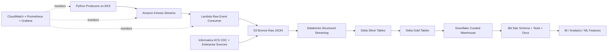

# Real-Time E-Commerce Analytics Platform on AWS

Portfolio-grade streaming analytics platform for high-volume e-commerce events. The design shows how orders, clicks, payments, customer sessions, and shipment updates move from containerized producers into AWS streaming infrastructure, land in a Bronze data lake, are refined with Databricks into Silver and Gold Delta tables, and are modeled in Snowflake with dbt.

## What This Demonstrates

- Real-time event generation with Python microservices
- AWS streaming ingestion with Kinesis, Lambda, S3, IAM, EKS, and CloudWatch
- Lakehouse processing with Databricks Structured Streaming and Delta Lake
- Warehouse modeling with Snowflake and dbt star schemas
- Enterprise ingestion and governance touchpoints for Informatica and OpenMetadata
- Production deployment patterns with Docker, Kubernetes, Helm, Terraform, and GitHub Actions
- Data quality coverage with dbt tests and Great Expectations

## Architecture



## Repository Map

```text
.
|-- services/
|   |-- event-producer/        # Dockerized Python generator for orders, clicks, payments, sessions
|   |-- api/                   # Lightweight FastAPI health and operational API
|   `-- lambda-consumer/       # Kinesis-to-S3 Bronze Lambda consumer
|-- infra/terraform/           # AWS, Snowflake, and monitoring modules
|-- k8s/helm/                  # Helm chart for producer/API workloads on EKS
|-- databricks/                # Streaming ETL notebook and job spec
|-- dbt/                       # Snowflake models, tests, docs, and marts
|-- airflow/                   # Orchestration DAG for lakehouse-to-warehouse pipeline
|-- great_expectations/        # Data quality suite for raw and refined events
|-- openmetadata/              # Metadata ingestion config stub
|-- docs/                      # Architecture notes and runbook
`-- .github/workflows/         # CI/CD pipeline
```

## Local Quickstart

The local workflow uses LocalStack for Kinesis and S3, then runs a producer that emits realistic events. This does not require AWS credentials. The Docker producer auto-creates the local Kinesis stream.

```bash
docker compose up --build
```

If you also want to create the local Bronze S3 bucket for Lambda testing:

```bash
python scripts/bootstrap_localstack.py
```

Run unit tests:

```bash
python scripts/run_tests.py
```

## Cloud Deployment Flow

1. Configure AWS, Snowflake, Databricks, and container registry secrets in GitHub Actions.
2. Initialize Terraform from `infra/terraform/envs/dev`.
3. Build and push the service images.
4. Deploy the Helm chart to EKS.
5. Deploy the Databricks streaming job.
6. Run dbt models and tests against Snowflake.
7. Enable monitoring alarms and dashboards.

## Event Contract

Each event uses a shared envelope:

```json
{
  "event_id": "uuid",
  "event_type": "order_created",
  "event_time": "2026-07-16T12:00:00Z",
  "customer_id": "cust_12345",
  "source": "event-producer",
  "payload": {}
}
```

Event-specific payloads are generated for:

- `order_created`
- `cart_updated`
- `product_viewed`
- `payment_authorized`
- `customer_session_started`
- `shipment_status_changed`

## Interview Talking Points

- Why Kinesis is used for ordered, scalable event ingestion.
- How S3 Bronze preserves immutable raw data for replay and audit.
- Why Databricks handles deduplication, schema enforcement, CDC, and sessionization before warehouse loading.
- How dbt creates reliable marts with tests, lineage, and documentation.
- Where Informatica fits for enterprise CDC, SAP/CRM ingestion, lineage, and governance.
- How Kubernetes autoscaling and CloudWatch alarms keep producers and consumers resilient.
